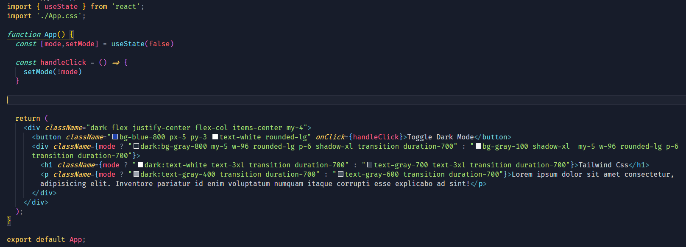

# Setup Dark mode with Tailwind CSS.

* npx create-react-app my-project

### Install Tailwind via npm

<pre>
* <code>npm install -D tailwindcss@npm:@tailwindcss/postcss7-compat postcss@^7 autoprefixer@^9
</code>

* <code>npm install @craco/craco</code>
</pre>
##### Once it’s installed, update your scripts in your package.json file to use craco instead of react-scripts for all scripts except eject:
<pre>
<code>
  {
    "scripts": {
     "start": "craco start",
     "build": "craco build",
     "test": "craco test",
        "eject": "react-scripts eject"
    },
  }
</code>
</pre>

##### Next, create a craco.config.js at the root of our project and add the tailwindcss and autoprefixer as PostCSS plugins:
<pre>
<code>
// craco.config.js
module.exports = {
  style: {
    postcss: {
      plugins: [
        require('tailwindcss'),
        require('autoprefixer'),
      ],
    },
  },
}
</code>
</pre>

##### Next, generate your tailwind.config.js file:

<pre>
<code>
// tailwind.config.js
module.exports = {
  purge: [],
  darkMode: false, // or 'media' or 'class'
  theme: {
    extend: {},
  },
  variants: {
    extend: {},
  },
  plugins: [],
}
</code>
</pre>

##### Configure Tailwind to remove unused styles in production

<pre>
<code>
// tailwind.config.js
  module.exports = {
   purge: [],
   purge: ['./src/**/*.{js,jsx,ts,tsx}', './public/index.html'],
    darkMode: false, // or 'media' or 'class'
    theme: {
      extend: {},
    },
    variants: {
      extend: {},
    },
    plugins: [],
  }
</code>
</pre>

##### Include Tailwind in your CSS
* Open the ./src/index.css file that Create React App generates for you by default and use the @tailwind directive to include Tailwind’s base, components, and utilities styles, replacing the original file contents:

<pre>
<code>
/* ./src/index.css */
@tailwind base;
@tailwind components;
@tailwind utilities;
</code>
</pre>

* Finally, ensure your CSS file is being imported in your ./src/index.js file:

<pre>
<code>
  // src/index.js
  import React from 'react';
  import ReactDOM from 'react-dom';
 import './index.css';
  import App from './App';
  import reportWebVitals from './reportWebVitals';

  ReactDOM.render(
    <React.StrictMode>
      <App />
    </React.StrictMode>,
    document.getElementById('root')
  );

  // ...
</code>
</pre>

##### You’re finished! Now when you run npm run start, Tailwind CSS will be ready to use in your Create React App project.

# Dark Mode Setup : 

##### Add class in tailwind.config.js.

<pre>
<code>
module.exports = {
  purge: [],
  purge: ['./src/**/*.{js,jsx,ts,tsx}', './public/index.html'],
  darkMode: 'class', // or 'media' or 'class'
  theme: {
    extend: {},
  },
  variants: {
    extend: {},
  },
  plugins: [],
}

</code>
</pre>

##### Now Darkmode enable in App.js

### Result: 

##### White Mode: 

##### Dark Mode:

